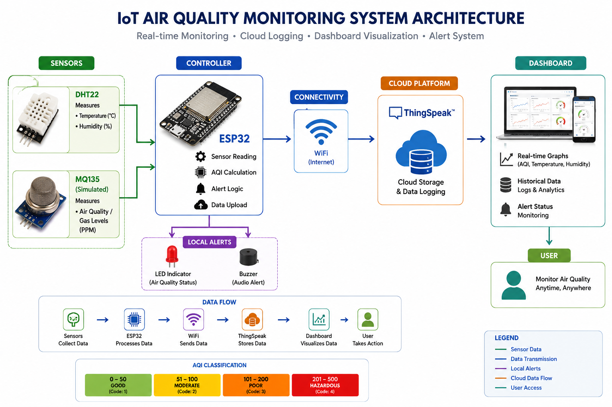
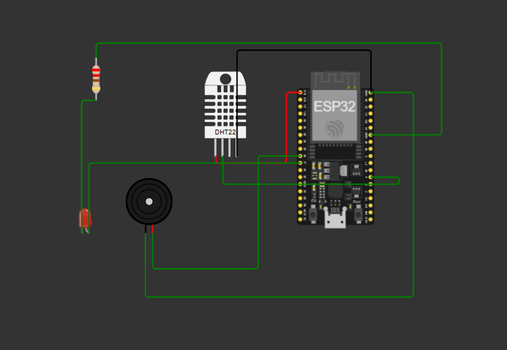
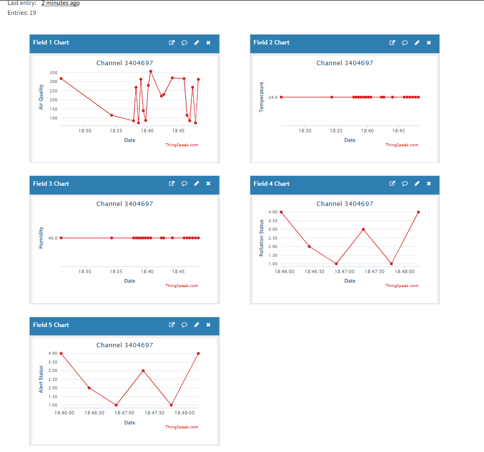
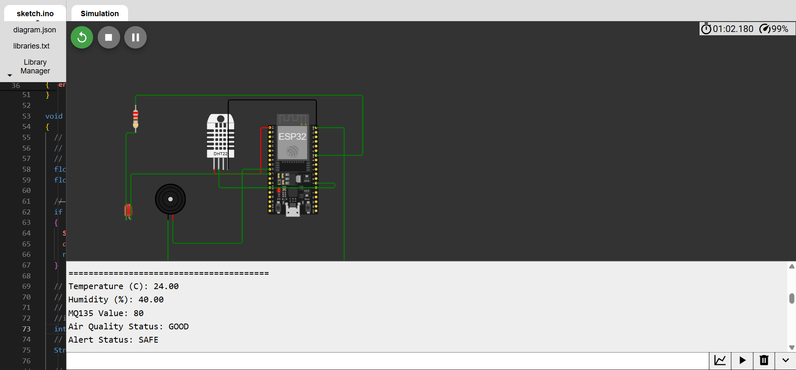
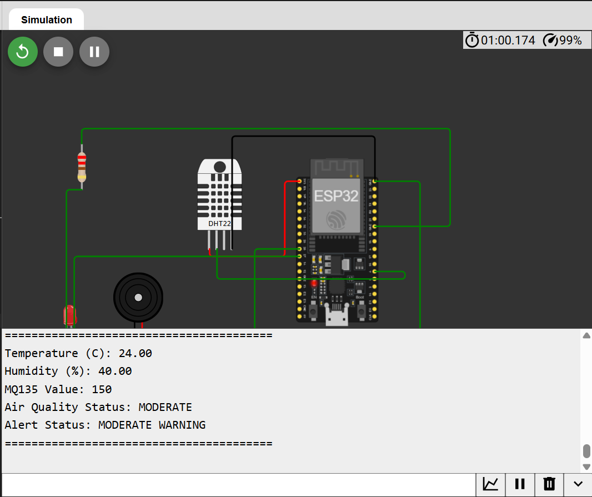
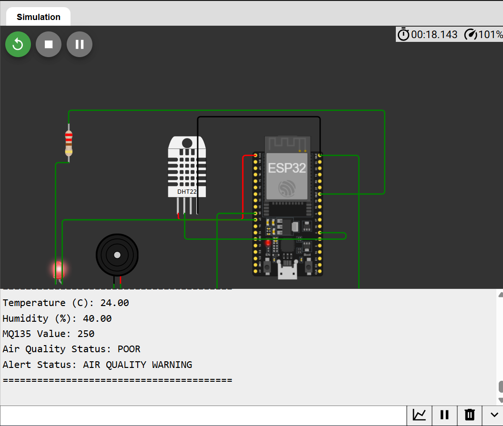
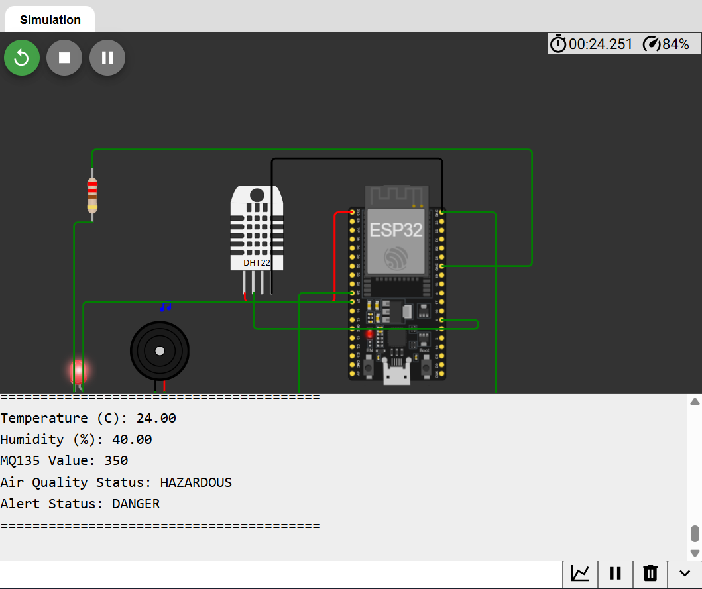

# 🌍 IoT-Based Air Quality & Pollution Monitoring Dashboard


---

## 📌 Project Overview

This project is an IoT-Based Air Quality & Pollution Monitoring Dashboard developed using ESP32, DHT22, a simulated MQ135 sensor, LED alerts, buzzer alerts, and ThingSpeak cloud integration.

The system continuously monitors environmental conditions, classifies air quality levels, generates alerts based on pollution severity, and uploads data to the cloud for real-time and historical monitoring.

The project was developed and tested using Wokwi simulation and is designed to be easily migrated to real hardware.

---

## 🎯 Objectives

- Monitor air quality in real time
- Measure temperature and humidity
- Classify pollution levels using AQI thresholds
- Generate visual and audible alerts
- Upload sensor data to ThingSpeak Cloud
- Store historical environmental data
- Demonstrate a complete IoT workflow

---

## 🏗 System Architecture



### Data Flow

```text
DHT22 + MQ135 (Simulated)
            ↓
          ESP32
            ↓
 AQI Classification Engine
            ↓
      Alert System
      (LED + Buzzer)
            ↓
           WiFi
            ↓
      ThingSpeak Cloud
            ↓
 Dashboard & Data Logs
            ↓
           User
```

---

## 🔌 Circuit Diagram



---

## 🛠 Components Used

| Component | Purpose |
|------------|------------|
| ESP32 DevKit | Main Controller |
| DHT22 | Temperature & Humidity Sensor |
| MQ135 (Simulated) | Air Quality Sensor |
| LED | Visual Alert |
| Buzzer | Audible Alert |
| ThingSpeak | Cloud Dashboard |
| Wokwi | Simulation Environment |

---

## ⚙ Working Principle

1. DHT22 measures temperature and humidity.
2. MQ135 values are simulated within Wokwi.
3. ESP32 processes sensor readings.
4. AQI levels are classified into predefined categories.
5. LED and buzzer alerts are triggered based on pollution severity.
6. Data is uploaded to ThingSpeak using WiFi.
7. Dashboard visualizes real-time and historical records.

---

## 📊 AQI Classification

| AQI Range | Status |
|------------|------------|
| 0 – 100 | GOOD |
| 101 – 200 | MODERATE |
| 201 – 300 | POOR |
| 301+ | HAZARDOUS |

---

## 🚨 Alert Logic

### GOOD
- LED OFF
- Buzzer OFF

### MODERATE
- LED Blinking
- No Buzzer

### POOR
- LED ON
- Short Buzzer Beep

### HAZARDOUS
- LED ON
- Continuous Buzzer

---

## ☁ ThingSpeak Cloud Dashboard

The ESP32 uploads:

- Air Quality Index
- Temperature
- Humidity
- Pollution Status Code
- Alert Status Code

to ThingSpeak for monitoring and data storage.

### Dashboard Screenshot



---

## 📈 Pollution Status Codes

| Code | Status |
|------|---------|
| 1 | GOOD |
| 2 | MODERATE |
| 3 | POOR |
| 4 | HAZARDOUS |

---

## 📈 Alert Status Codes

| Code | Alert |
|------|---------|
| 1 | SAFE |
| 2 | MODERATE WARNING |
| 3 | AIR QUALITY WARNING |
| 4 | DANGER |

---

## 🖼 Simulation Results

### Good Air Quality



### Moderate Air Quality



### Poor Air Quality



### Hazardous Air Quality



---

## 📂 Repository Structure

```text
IoT-Air-Quality-Monitoring-Dashboard
│
├── code
│   ├── sketch.ino
│   ├── diagram.json
│   └── libraries.txt
│
├── data
│   └── air_quality_dataset.csv
│
├── docs
│   ├── IoT_Air_Quality_Monitoring_Dashboard_Report_Dharshini_R.pdf
│   └── IoT_Air_Quality_Monitoring_Dashboard_Presentation_Dharshini_R.pptx
│
├── images
│   ├── circuit_design.png
│   ├── good_air_quality.png
│   ├── moderate_air_quality.png
│   ├── poor_air_quality.png
│   ├── hazardous_air_quality.png
│   ├── thingspeak_complete_dashboard.png
│   └── system_architecture.png
│
├── LICENSE
│
└── README.md
```

---

## 📊 Dataset

Dataset exported from ThingSpeak:

```text
data/air_quality_dataset.csv
```

The dataset contains:

- Timestamp
- AQI Value
- Temperature
- Humidity
- Pollution Status
- Alert Status

---

## 🚀 Future Enhancements

- Real MQ135 Integration
- Mobile Dashboard
- MQTT Communication
- Email/SMS Alerts
- AI-Based Pollution Prediction
- Python Analytics Dashboard

---

## 🎓 Learning Outcomes

This project demonstrates:

- ESP32 Programming
- IoT System Design
- Sensor Integration
- Cloud Connectivity
- Data Logging
- Dashboard Development
- AQI Monitoring
- Real-Time Alert Systems

---

## 👩‍💻 Author

**Dharshini**

IoT-Based Air Quality & Pollution Monitoring Dashboard

Developed using ESP32, DHT22, Simulated MQ135, Wokwi, and ThingSpeak Cloud.
